# Manual Técnico

## Integrantes

| Carnet     |Nombre                        |
|------------|------------------------------|
| 202006353  | Juan Josue Zuleta Beb        |
| 202010770  | Luis Mariano Moreira Garcia  |
| 202003220  | Marco Antonio Solis Gonzalez |

## OBJETIVOS DEL PROYECTO

### Objetivo General:
Desarrollar una aplicación web segura y escalable que ofrezca servicios de transporte para movilizar a usuarios hacia destinos turísticos dentro del país, proporcionando una experiencia de usuario optimizada y utilizando tecnologías avanzadas de Amazon Web Services (AWS) para la gestión eficiente de reservas, información turística y comunicaciones.

### Objetivos Específicos:
Ofrecer una plataforma segura de gestión de usuarios:

Implementar Amazon Cognito para la autenticación y gestión segura de perfiles de usuario, asegurando protección de datos y accesibilidad mediante un proceso de registro e inicio de sesión robusto.
Facilitar la reserva de viajes a destinos turísticos:

Permitir a los usuarios explorar y agendar viajes de manera eficiente, confirmando transacciones mediante funciones AWS Lambda que automatizan el envío de correos electrónicos con los boletos y detalles del viaje.
Gestionar el historial de viajes de los usuarios:

Mantener un registro accesible de los viajes agendados por cada usuario, almacenado en una base de datos relacional gestionada con Amazon RDS, proporcionando acceso rápido y seguro a la información de viajes previos.

## DESCRIPCIÓN DEL PROYECTO

Fastravel, aplicación web que ofrece servicios de transporte para movilizar a la gente a sitios turisticos en el país. El usuario puede crear su perfil de manera segura (COGNITO), donde puede agendar viajes a destinos turisticos, tambien se llevara un registro de sus viajes. Al momento de agendar un viaje a un sitio turistico, se enviaran un correo confirmando su transacción con el boleto (LAMBDA). Dentro de la aplicación, un destino turístico contendra una imagen y se extraera información relevante por medio de labels (REKOGNITION Y S3). Tambien en cada destino turistico dentro de la aplicación, habra un chatbot que pueda ayudar al usuario a agendar su viaje (LEX), cada sitio turistico tendra sus reseñas (incluyendo descripcion), que pueden ser traducidas a varios lenguajes (TRANSLATE) y tambien se podran escuchar (POLLY) laarquitectura de la aplicacion requiere el uso de 2 servidores con instancias EC2, con su balanceador de carga. Toda la información persistente, exceptuando los objetos, seran almacenados en una instancia de RDS. El  alojamiento del sitio estatico será alojado en S3. Por ultimo manejaremos las peticiones por medio de API GATEWAY. Servicio propuesto: Amazon Location, que podra mostrar ubicaciones de los lugares.

## Arquitectura

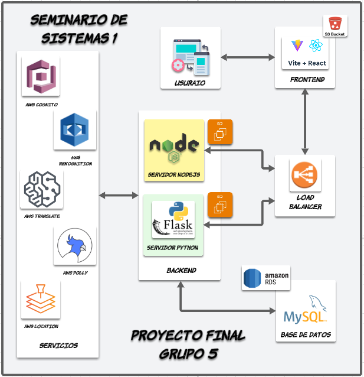

Fastravel es una aplicación web diseñada para ofrecer servicios de transporte especializados en movilizar a los usuarios hacia sitios turísticos dentro del país. La plataforma permite a los usuarios crear perfiles de manera segura mediante Amazon Cognito, lo que garantiza un proceso de autenticación confiable y sencillo. Una vez registrado, el usuario puede agendar viajes a diversos destinos turísticos, los cuales se registrarán en su historial de viajes, permitiéndole llevar un control de sus actividades y preferencias de manera eficiente.

Al momento de que un usuario agenda un viaje hacia un destino turístico, se desencadena un proceso automatizado a través de AWS Lambda, el cual genera y envía un correo de confirmación al cliente, incluyendo los detalles de la transacción y el boleto correspondiente. Este sistema garantiza una comunicación fluida y confiable entre la plataforma y el usuario, optimizando la experiencia de reserva de viajes.

Cada destino turístico en la aplicación estará enriquecido con imágenes almacenadas en Amazon S3. Para mejorar la experiencia del usuario, se utilizará Amazon Rekognition para extraer información relevante a través de etiquetas (labels) asociadas con las imágenes. Esto permitirá a los usuarios obtener una visión más completa y detallada de cada lugar turístico, brindando información contextual sin necesidad de búsqueda manual.

Además, Fastravel integrará un chatbot interactivo en cada página de destino turístico, alimentado por Amazon Lex. Este chatbot asistirá a los usuarios en el proceso de agendar sus viajes, respondiendo preguntas y guiando de manera intuitiva y personalizada a los viajeros a lo largo del proceso de reserva. La implementación de Lex permitirá una interacción fluida y rápida, mejorando la eficiencia en la atención al cliente.

Cada destino turístico también contará con un sistema de reseñas, donde los usuarios podrán compartir sus experiencias. Estas reseñas incluirán descripciones detalladas que podrán ser traducidas a diferentes idiomas mediante Amazon Translate, facilitando la comprensión a usuarios de todo el mundo. Además, los comentarios podrán ser escuchados gracias a la integración de Amazon Polly, que convertirá el texto en voz, brindando accesibilidad a personas con discapacidad visual o usuarios que prefieran escuchar las reseñas.

En cuanto a la arquitectura de la aplicación, se utilizarán dos servidores con instancias EC2 para manejar el tráfico y la carga del sistema. Para asegurar la disponibilidad y escalabilidad de la aplicación, estas instancias estarán detrás de un balanceador de carga (ELB), lo que garantizará la distribución eficiente de las solicitudes y evitará la saturación de los servidores. La información persistente, con excepción de los objetos como imágenes y archivos multimedia, será almacenada en una base de datos relacional gestionada mediante Amazon RDS, asegurando la integridad y disponibilidad de los datos.

El sitio web estático de Fastravel será alojado en Amazon S3, lo que permitirá una entrega rápida y eficiente del contenido, al tiempo que proporciona escalabilidad y durabilidad para los activos estáticos de la aplicación. Todas las solicitudes y comunicaciones entre el frontend y backend de la aplicación serán gestionadas a través de Amazon API Gateway, que actuará como punto de entrada para todas las peticiones del cliente, garantizando una gestión eficiente y segura del tráfico.

Por último, la aplicación aprovechará Amazon Location Service para mostrar las ubicaciones exactas de los destinos turísticos dentro del país. Esta funcionalidad permitirá a los usuarios obtener una visualización clara y precisa de la localización de cada sitio turístico, facilitando la planificación de rutas y la toma de decisiones respecto a su viaje. Esto enriquece aún más la experiencia del usuario, ofreciendo un servicio completo y robusto para la exploración turística.

Con esta arquitectura, Fastravel combina de manera eficiente diversos servicios de AWS para ofrecer una experiencia segura, escalable y accesible para los usuarios, brindando herramientas avanzadas que simplifican la planificación y reserva de viajes a destinos turísticos.

## Descripcion de Usuarios
Para garantizar un acceso seguro y segmentado a los servicios de AWS, se crearon usuarios específicos en IAM, cada uno con permisos limitados a un servicio particular:

#### Usuario IAM para EC2
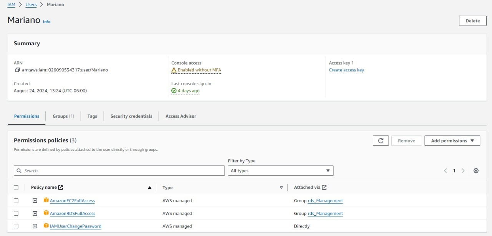

#### Usuario IAM para S3
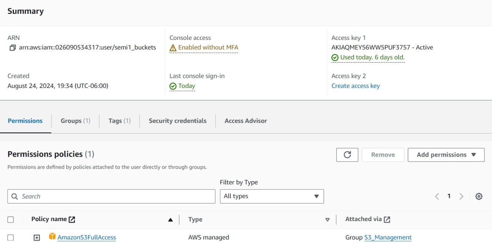

#### Usuario IAM para COGNITO
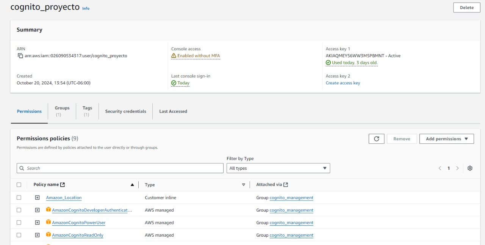

#### Usuario para rekognition y translate
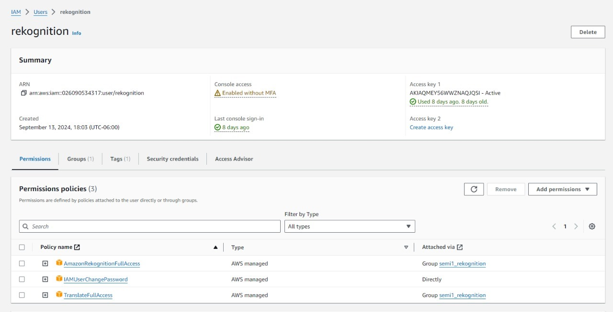

## Descripcion de los servicios

#### Bucket de Amazon S3

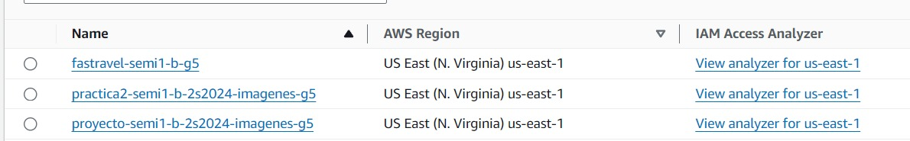
Se crearon dos buckets de S3 para almacenar los archivos multimedia y el sitio web estático de la aplicación. Los buckets son accesibles públicamente y se encuentran configurados para permitir el acceso a través de un dominio personalizado.

#### Instancias de Amazon EC2
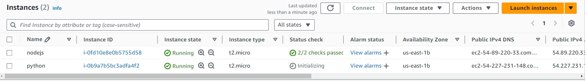
Se crearon dos instancias de EC2 para ejecutar la aplicación, una con Node.js y otra con Python. Las instancias se encuentran detrás de un balanceador de carga que distribuye el tráfico entre ellas, asegurando alta disponibilidad y manejo eficiente de las solicitudes.

#### Balanceador de carga 
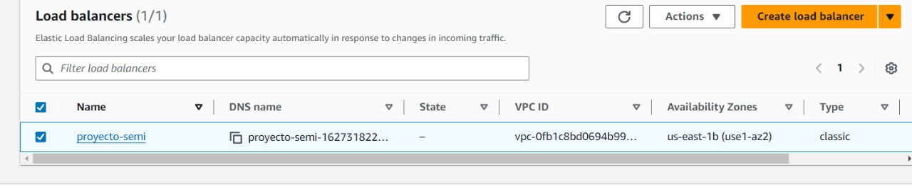
Se creó un balanceador de carga de EC2 para distribuir el tráfico entre las instancias de la aplicación. El balanceador de carga se encuentra configurado para redirigir el tráfico a las instancias de manera equitativa, asegurando alta disponibilidad y manejo eficiente de las solicitudes

#### Pool de Cognito

Al crear un pool de usuarios, buscamos simplificar el registro, el inicio de sesión y la administración de perfiles de usuario, ademas contamos con una funcionalidad de verificacion por correo.

#### Funciones lambda
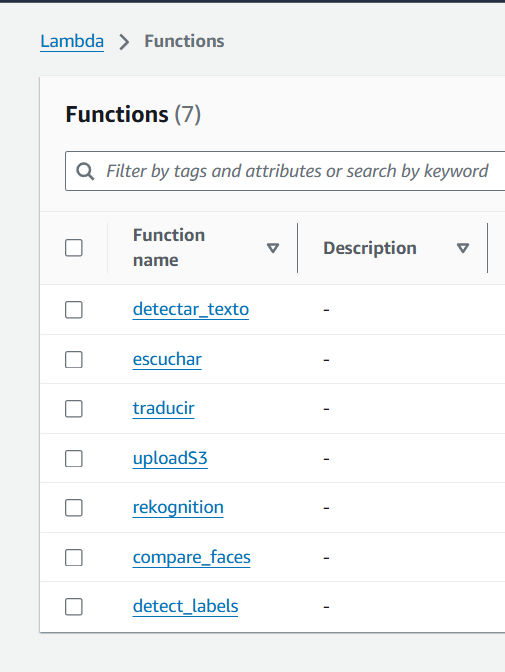
Es un servicio de computación sin servidor que permite ejecutar código en respuesta a eventos sin necesidad de aprovisionar o gestionar servidores. 

#### API GATEWAY
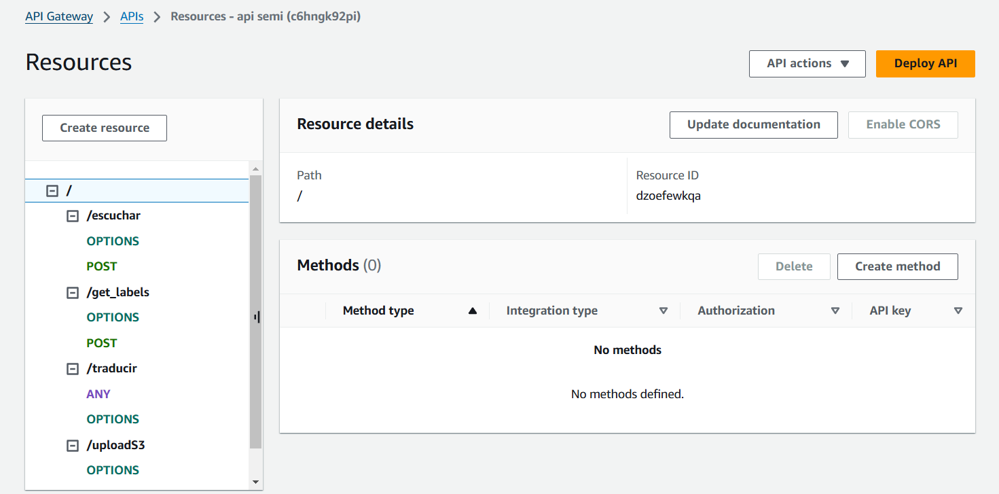
Creamos este servicio para la creacion y la gestion de nuestra API, es nuestro punto de entrada para nuestras funciones lambda

#### RDS
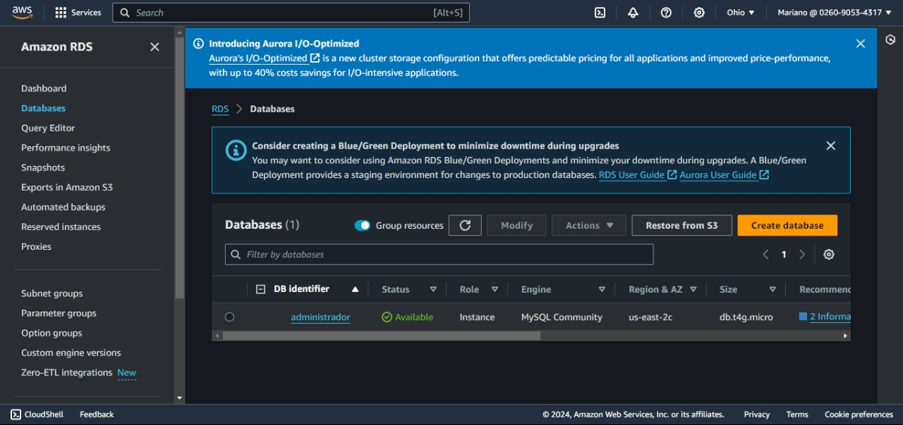
Se creó una instancia de RDS para almacenar la información de los usuarios y las imágenes de la aplicación. La base de datos se encuentra configurada con un modelo relacional que permite almacenar y recuperar información de manera eficiente.

## Presupuesto del Proyecto Fastravel (Estimación basada en servicios AWS)

| Servicio                     | Costo Estimado (USD/mes) |
|------------------------------|--------------------------|
| Amazon EC2 (2 instancias)     | $135.34                  |
| Elastic Load Balancer (ELB)   | $16.20                   |
| Amazon RDS                    | $32.67                   |
| Amazon S3                     | $2.55                    |
| Amazon Rekognition            | $5.00                    |
| Amazon Cognito                | $0.00                    |
| AWS Lambda                    | $0.00                    |
| Amazon Lex                    | $0.00                    |
| Amazon Translate              | $7.50                    |
| Amazon Polly                  | $0.00                    |
| Amazon API Gateway            | $0.00                    |
| Amazon Location Service       | $2.50                    |

## Investigacion  Servicios Utilizados en AWS

| Servicio                     | Descripción                                                                                                      | Casos de Uso                                           | Costo Estimado (USD/mes) |
|------------------------------|------------------------------------------------------------------------------------------------------------------|--------------------------------------------------------|--------------------------|
| **Amazon EC2 (2 instancias)** | Proporciona instancias virtuales escalables para ejecutar aplicaciones en la nube.                                | Hosting de aplicaciones, procesamiento de datos.        | $135.34                  |
| **Elastic Load Balancer (ELB)**| Distribuye tráfico entre múltiples instancias EC2, mejorando disponibilidad y escalabilidad.                     | Balanceo de tráfico, alta disponibilidad.               | $16.20                   |
| **Amazon RDS**                | Servicio de bases de datos relacionales gestionado.                                                               | Bases de datos para aplicaciones escalables.            | $32.67                   |
| **Amazon S3**                 | Almacenamiento de objetos escalable y duradero para cualquier tipo de dato.                                       | Almacenamiento de archivos estáticos, backups.          | $2.55                    |
| **Amazon Rekognition**        | Análisis de imágenes y videos mediante IA, incluyendo reconocimiento facial y de objetos.                        | Reconocimiento facial, análisis multimedia.             | $5.00                    |
| **Amazon Cognito**            | Autenticación y autorización para aplicaciones, con inicio de sesión social y administración de usuarios.         | Gestión de usuarios, autenticación.                     | $0.00                    |
| **AWS Lambda**                | Ejecución de código sin servidor en respuesta a eventos, sin necesidad de gestionar servidores.                   | Backend sin servidor, procesamiento de eventos.         | $0.00                    |
| **Amazon Lex**                | Creación de interfaces conversacionales como chatbots y asistentes virtuales.                                      | Chatbots, asistentes virtuales.                         | $0.00                    |
| **Amazon Translate**          | Traducción automática de idiomas utilizando inteligencia artificial.                                              | Aplicaciones multilingües, traducción de contenido.      | $7.50                    |
| **Amazon Polly**              | Conversión de texto a voz utilizando deep learning para generar discursos realistas.                               | Lectura de texto, asistentes de voz.                    | $0.00                    |
| **Amazon API Gateway**        | Creación y gestión de APIs REST y WebSocket escalables.                                                           | Creación de APIs, backend de aplicaciones.              | $0.00                    |
| **Amazon Location Service**   | Servicios de mapas, geocodificación, seguimiento y geovallas.                                                     | Aplicaciones basadas en ubicación, seguimiento en tiempo real. | $2.50            |
