# Manual Usuario

## Integrantes

| Carnet     |Nombre                        |
|------------|------------------------------|
| 202006353  | Juan Josue Zuleta Beb        |
| 202010770  | Luis Mariano Moreira Garcia  |
| 202003220  | Marco Antonio Solis Gonzalez |

## Funcionalidades

**Home**

En este apartado podra visualizar la pagina principal de la aplicacion, en la cual se muestra un menu de opciones para poder navegar por la aplicacion. Entre las opciones que se encuentran en el menu se encuentran:

- **Home**: Regresa a la pagina principal.
- **Login**: Permite iniciar sesion en la aplicacion.
- **Registro**: Permite registrarse en la aplicacion.
- **Revisar un viaje**: Permite visualizar el perfil del usuario.

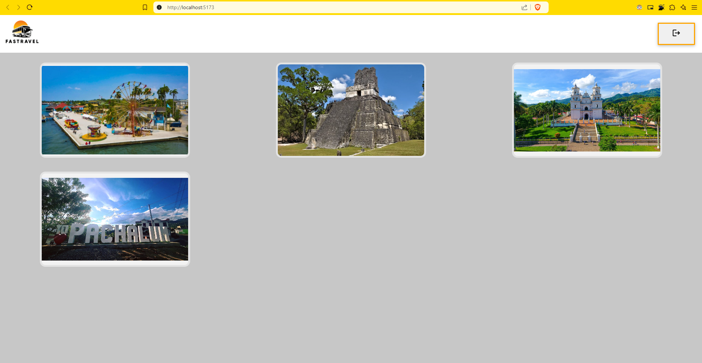

**Login**

En este apartado podra iniciar sesion en la aplicacion, para ello debera ingresar su correo electronico y su contraseña. En caso de no tener una cuenta, podra registrarse en la aplicacion.

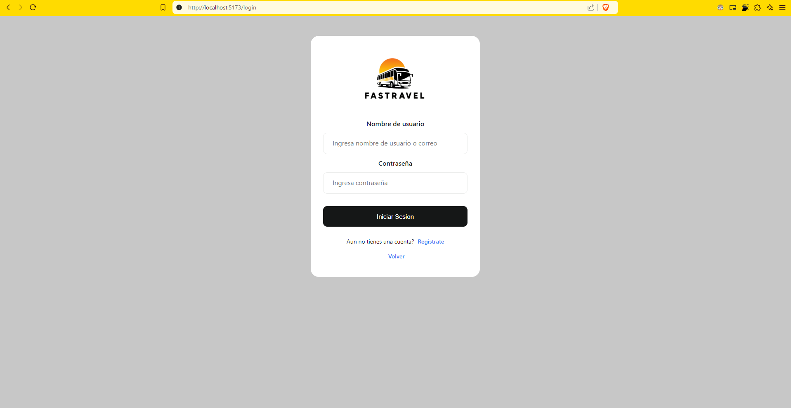

**Registro**

En este apartado podra registrarse en la aplicacion, para ello debera ingresar su nombre, correo electronico, contraseña y confirmar la contraseña. En caso de ya tener una cuenta, podra iniciar sesion en la aplicacion.

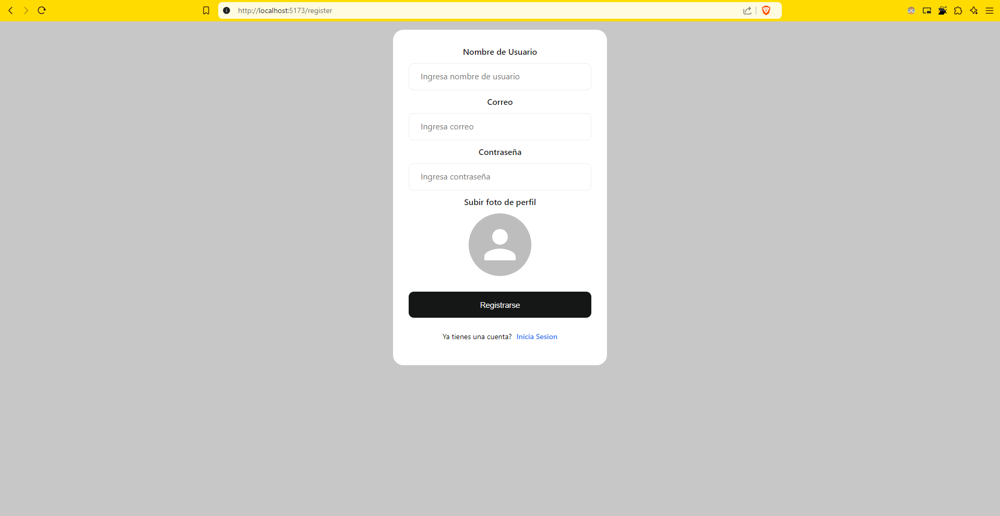

Una vez iniciado el registro se enviara un correo electronico de confirmacion para poder activar la cuenta.

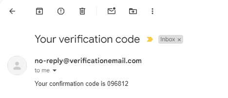

Una vez confirmada la cuenta, podra iniciar sesion en la aplicacion.

**Revisar un viaje**

En este apartado de home podra visulaizar el las caracteristicas de un viaje poniendo el mosue sobre la cartilla del viaje mostrara la informacion del viaje.
s
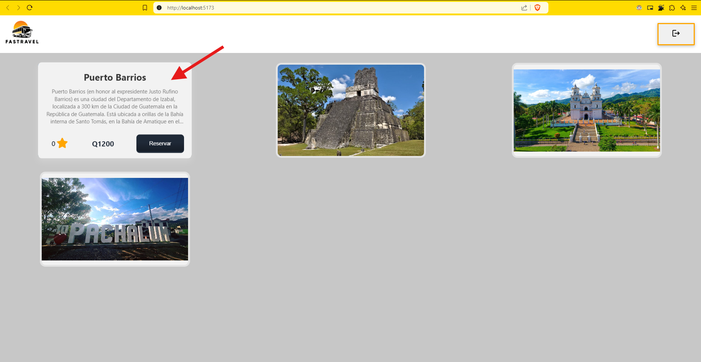

Cuando se presiona el boton de "Reservar" se mostrara un modal con la informacion del viaje, ubicacion del lugar, comentarios y calificacion del lugar.

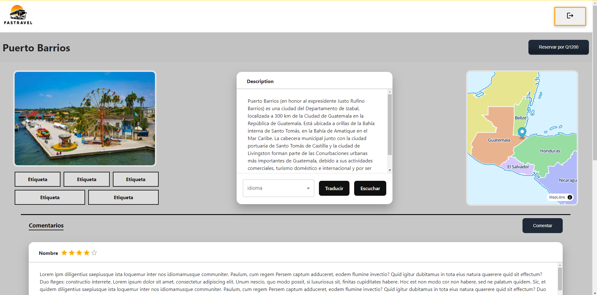

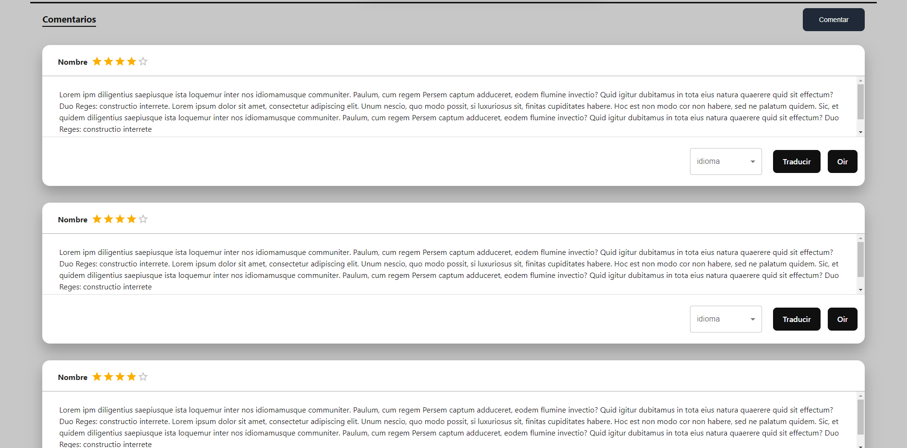

**Funcionalidades de este apartado**

Se puede traducir la descripcion del viaje a diferentes idiomas.

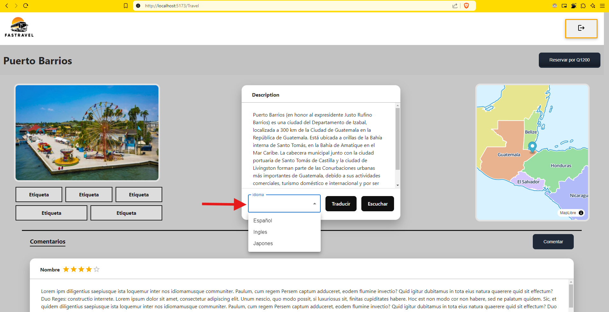

una vez seleccionado el idioma se mostrara la descripcion del viaje en el idioma seleccionado.

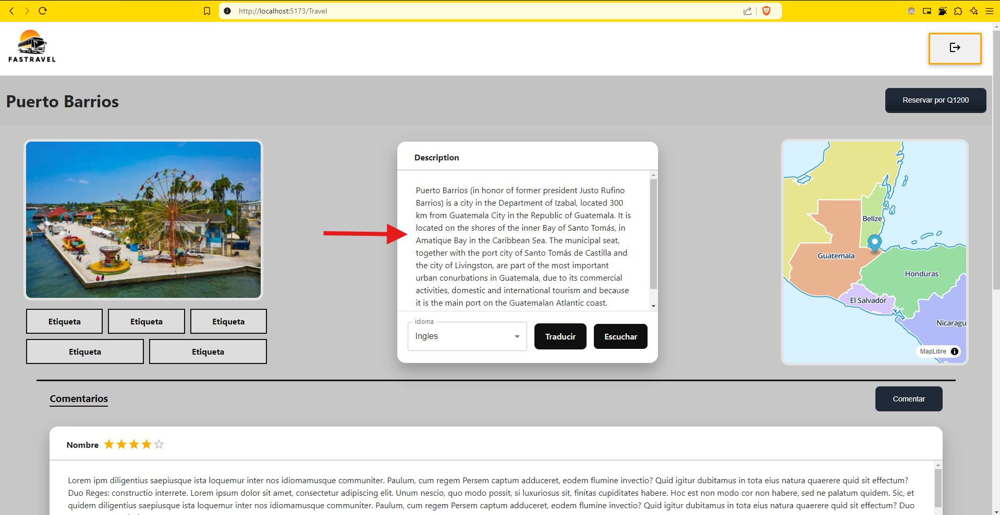

Tambien se puede escuchar la descripcion del viaje en diferentes idiomas.

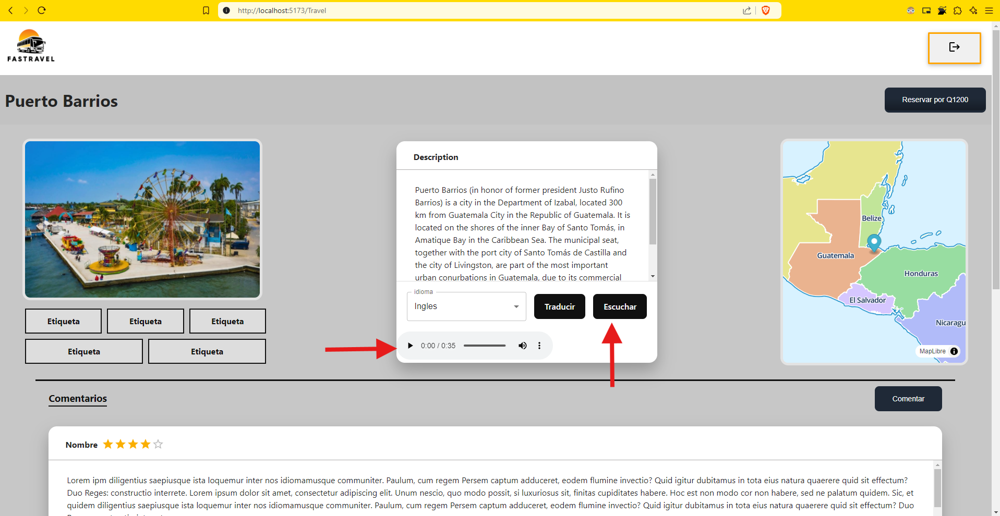

**Reservar el Viaje**

Para reservar el viaje debera presionar el boton de "Reservar Por" y se mostrara un modal con la informacion del viaje, ubicacion del lugar, comentarios y calificacion del lugar.

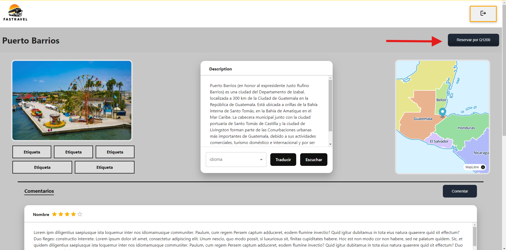

En esta parte se mostrara un formulario para poder reservar el viaje, en el cual debera ingresar el nombre de usuario, su correo, la fecha de inicio y la fecha de finalizacion del viaje y por ultimo la contraseña para confirmar la reserva.

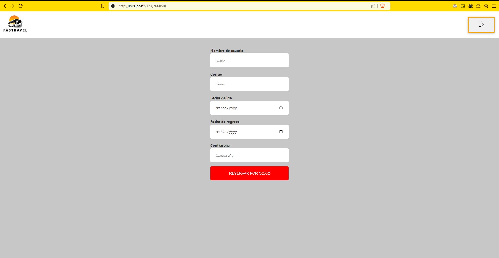

